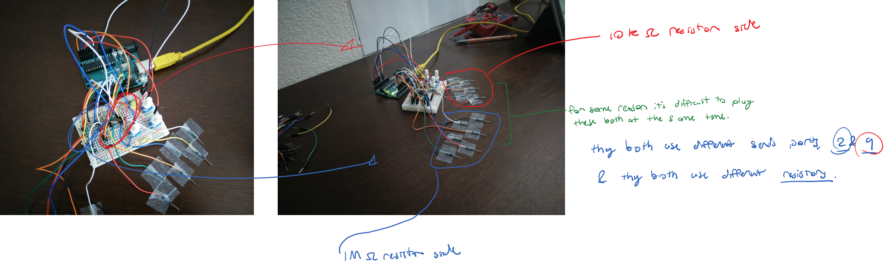
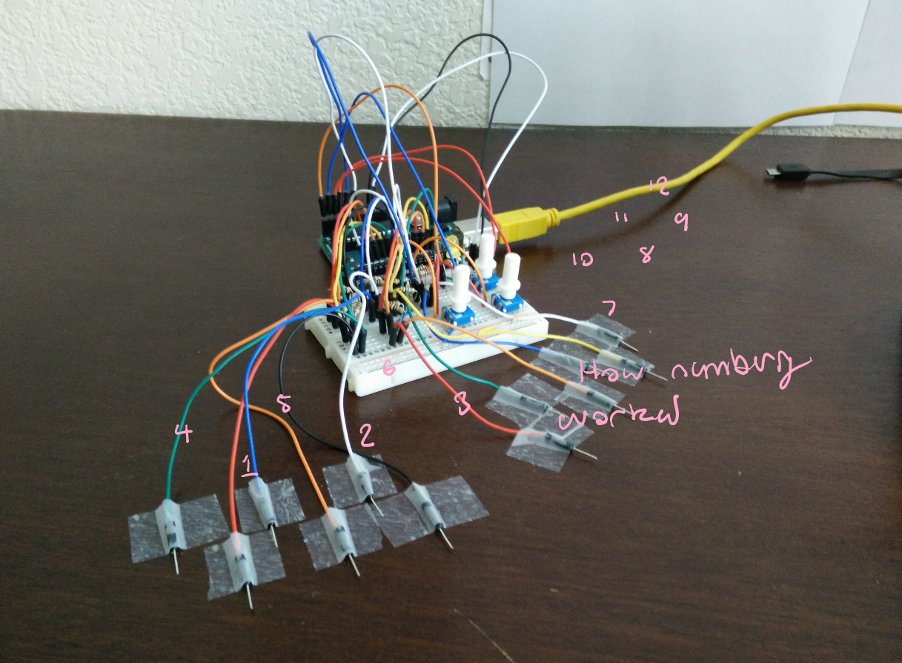

# x3_midi_capacitive_sensor
The second iteration of my capacitive midi device. Second to distance_capacitive_test.

## notes:
This version does not include capacitors simply because I don’t have enough capacitors. my results seemed to be rather consistent without them anyway. I was making this project without plugging in my laptop which made me ungrounded. BAD MISTAKE! 
 
 below are some photos.
 

